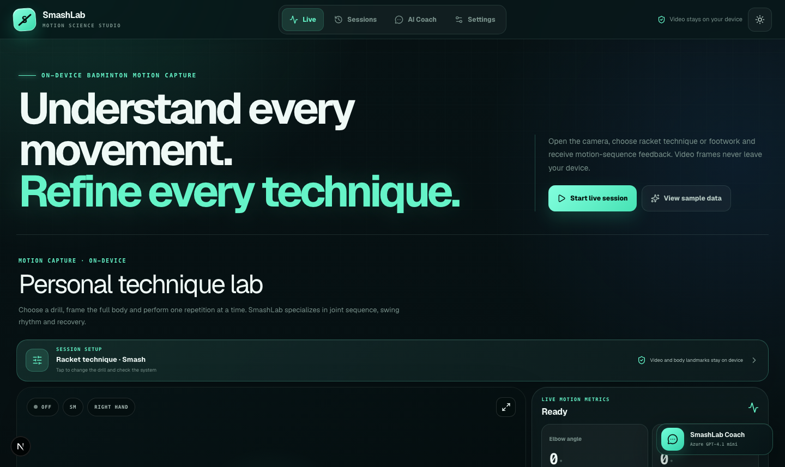
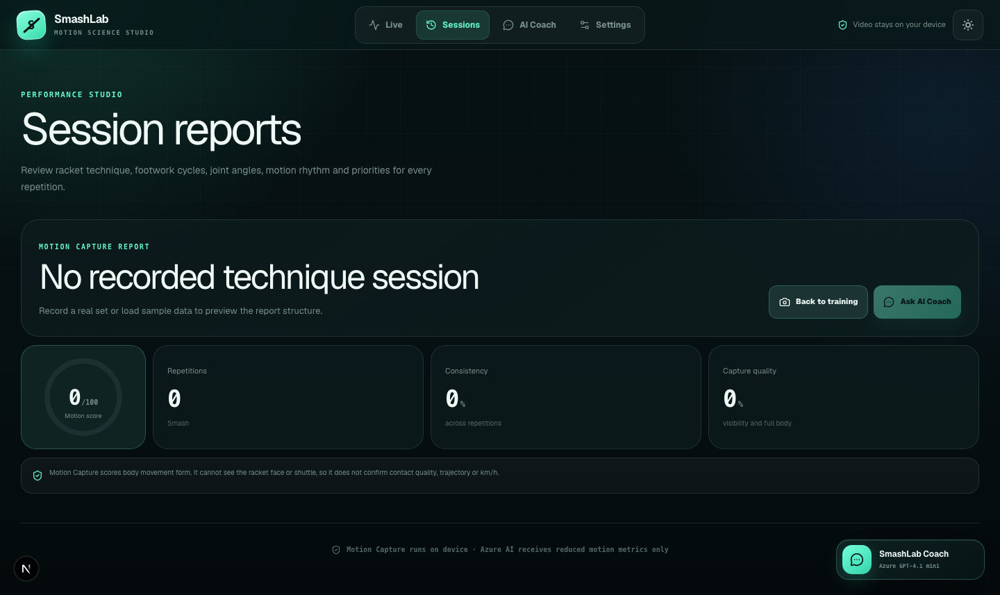
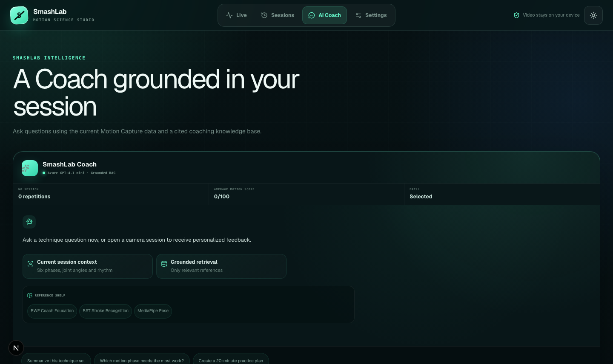

# SmashLab Motion Science Studio

SmashLab is a browser-first badminton training studio that turns a phone camera into a practical motion-analysis tool. It helps players review racket technique and footwork through on-device pose tracking, repeatable session scores, and an AI coach grounded in the session's motion metrics.

Built with **Next.js 16**, **React 19**, **TypeScript**, **MediaPipe Tasks Vision**, and **Azure OpenAI**, then deployed as a lightweight **PWA on Vercel**.

> The interesting constraint: video frames stay on the athlete's device. The optional AI Coach receives reduced motion metrics, never raw video or camera frames.

## Product tour

### Live Motion Capture

Frame one athlete, confirm the target, choose a drill, and record a set. SmashLab tracks body landmarks, separates repetitions into motion phases, and surfaces technique signals such as elbow angle, shoulder position, knee bend, trunk rotation, rhythm, balance, and recovery.



### Session Reports

Review repetition count, motion score, consistency, capture quality, and the main priorities to work on. Sessions are persisted locally with IndexedDB, so the app does not need a video-processing backend or database.



### AI Coach

Ask questions about the current training data and get practical explanations from a grounded badminton knowledge base. The coach is designed to explain what the motion metrics suggest, not to pretend it can see racket contact or shuttle flight.



## What it can do

- Track up to four people in frame, verify a stable target across multiple frames, and pause scoring instead of switching athletes after an occlusion.
- Analyse racket technique drills: Smash, Backhand, Clear, Drop Shot, Drive, or automatic grouping.
- Analyse footwork cycles such as split step, chassé, lunge, jump and landing, scissor jump, China jump, and recovery to base.
- Use MediaPipe Pose Landmarker Lite, optional world landmarks, appearance-aware tracking, and a Web Worker when supported.
- Compare repetitions and highlight technique strengths, consistency, balance, recovery, and capture quality.
- Store up to 12 sessions locally on the device with no account or database.
- Offer English, Vietnamese, and German UI copy, plus dark and light training themes.
- Provide an optional Azure OpenAI Coach route with rate limiting and retrieval-grounded badminton references.

## AI and computer vision technology

SmashLab combines local computer vision with a focused generative-AI layer. Each part has a different responsibility:

- **MediaPipe Pose Landmarker Lite** detects full-body landmarks directly in the browser. Optional world landmarks provide a more stable 3D-aware signal when the device supports them.
- **On-device motion analysis** converts landmark sequences into joint angles, body extension, trunk rotation, balance, rhythm, footwork travel, and recovery signals. This keeps raw camera frames local and makes the core analysis fast enough for a phone.
- **Multi-athlete target lock** follows up to four people with a lightweight MOT pipeline inspired by SORT, ByteTrack, and OC-SORT. It combines Kalman motion prediction, observation-direction consistency, two-stage confidence association, body scale, and a bounded torso-appearance gallery. After an occlusion, observation-centric re-updates correct stale velocity before tracking continues. A target must remain stable across multiple frames before it can be locked, and ambiguous recovery pauses scoring rather than silently switching athletes. This is not face recognition.
- **Rule-based motion classification** groups movement sequences into racket-technique and footwork drills. The classifier is intentionally evidence-aware: it can report insufficient evidence instead of claiming to see shuttle contact, racket-face angle, or flight trajectory.
- **Web Worker processing** moves pose inference and sequence evaluation off the main UI thread when the browser supports it, keeping the Studio responsive during live capture.
- **Retrieval-augmented generation (RAG)** selects relevant badminton coaching references before the AI Coach answers. This gives the assistant a constrained knowledge context instead of relying only on a general language model.
- **Azure OpenAI GPT-4.1 mini** turns reduced session metrics into practical coaching explanations, priorities, and practice suggestions. The model receives structured analysis data and text questions, not video frames.

This hybrid design uses deterministic computer-vision logic for measurable movement signals and generative AI for explanation. It keeps the safety-critical product boundaries visible: the AI Coach explains movement evidence, while it does not invent shuttle speed, contact timing, or trajectory data.

## Target-lock methodology

The browser tracker adapts established multi-object tracking ideas to a small badminton scene without adding a server-side video pipeline or a heavyweight person-identification model:

- **Global association:** detections and active tracks are matched as one assignment problem, using predicted position, body scale, box overlap, appearance, and motion-direction costs.
- **ByteTrack-inspired confidence stages:** reliable pose detections are associated first; lower-confidence observations may recover an existing track but cannot create an unverified athlete identity.
- **OC-SORT-inspired motion handling:** recent observations provide a direction-consistency signal, while virtual observations re-update the Kalman state after short occlusions and reduce stale-velocity errors.
- **Conservative identity recovery:** a small appearance gallery and the last observed trajectory rank candidates after a longer loss. Recovery requires a unique margin and three consecutive confirmations; otherwise scoring remains paused.

These are product-focused adaptations of ideas described in [SORT](https://arxiv.org/abs/1602.00763), [ByteTrack](https://arxiv.org/abs/2110.06864), and [OC-SORT](https://openaccess.thecvf.com/content/CVPR2023/html/Cao_Observation-Centric_SORT_Rethinking_SORT_for_Robust_Multi-Object_Tracking_CVPR_2023_paper.html), not a claim of reproducing their benchmark results. The repository tests identity continuity across reordered detections, same-shirt crossings, confidence drops, occlusion recovery, and ambiguous re-entry.

## Important scope

SmashLab analyses body movement form. It does **not** detect the racket face or shuttle, confirm contact timing, calculate official speed in km/h, reconstruct shuttle trajectory, or replace a qualified coach. Scores are internal training signals, not BWF ratings or scientific accuracy claims. Measurements such as foot speed and centre-of-mass speed are normalised relative values because the camera is not calibrated to a court.

## Run locally

### Requirements

- Node.js 20+
- A modern browser with camera access
- npm

### 1. Install dependencies

```bash
npm install
```

### 2. Configure optional AI Coach access

Copy the example environment file:

```bash
cp .env.example .env.local
```

The camera analysis works without Azure credentials. To enable the AI Coach, set these server-only variables in `.env.local`:

```env
AI_ASSISTANT_ENABLED=true
AZURE_RESOURCE_NAME=your-resource-name
AZURE_API_KEY=your-server-side-key
AZURE_OPENAI_DEPLOYMENT=your-deployment-name
AZURE_OPENAI_API_VERSION=v1
```

Never expose `AZURE_API_KEY` with a `NEXT_PUBLIC_` prefix.

### 3. Start the development server

```bash
npm run dev
```

Open [http://localhost:3000](http://localhost:3000), allow camera access, and follow the setup guide. For reliable tracking, place the phone around hip height, 3–5 metres from the athlete, keep the full body in frame, and avoid backlight. The first visit needs internet access to download the MediaPipe WASM runtime and Pose Landmarker model.

## Verify the project

```bash
npm run lint
npm run test:vision
npm run test:rag
npm run build
```

The test suite covers pose classification, pose metrics, motion phases, footwork analysis, multi-person tracking, appearance matching, and retrieval logic.

## Deploy to Vercel

SmashLab is a standard Next.js App Router application and can be deployed directly to Vercel:

1. Import the repository in the [Vercel dashboard](https://vercel.com/new).
2. Keep the default build command, or use `npm run build`.
3. Add the optional Azure variables under **Project Settings → Environment Variables**.
4. Deploy and open the generated HTTPS URL so browsers can grant camera permission.

Video inference runs in the browser, so Vercel only serves the application and handles the optional AI Coach Route Handler. No Python service, GPU instance, or cloud video pipeline is required.

## Architecture at a glance

```text
Camera
  → MediaPipe Pose Landmarker (browser)
  → Web Worker + athlete tracking + motion metrics
  → Local session store (IndexedDB)
  → Session reports / AI Coach
                         ↘ reduced metrics → Azure OpenAI Route Handler
```

The main app lives in `src/app`, UI composition is in `src/components`, and the analysis pipeline is kept in focused modules under `src/lib`. The project is intentionally designed to keep raw camera data local while making the analysis logic testable independently of the UI.

## License

This project is licensed under the [MIT License](LICENSE). Copyright (c) 2026 Viet Phung.
